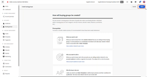
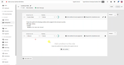

# [!DNL Journey Optimizer B2B Edition] Zelfstudies

Leer hoe u het beste kunt halen uit [!DNL Journey Optimizer B2B Edition] . Orchestrate account and purchase group traps using built-in generative AI and industrial-leading automation to maximize demand for specific offerings.

## Nieuwe functies {#whats-new}

* [ Kopen groepsstadia](/help/main/buying-groups/buying-group-stages.md)
  _leer hoe te om veelvoudige het kopen fasen van de paginaleven van de groepslevenscyclus binnen één enkel werkgebiedmodel tot stand te brengen en de overgangsregels te specificeren._

* [ Luister naar AEP-gebeurtenissen](/help/main/account-journeys/journey-nodes/listen-for-aep-events.md)
  _bepaal en gebruik om het even welke ervaringsgebeurtenis in uw rekeningsreis._

* [ Betaalde media orkest](/help/main/account-journeys/journey-nodes/paid-media-orchestration.md)
  _leer hoe te om een reis te gebruiken om mensen in een extern publiek te bewegen, dat u aan om het even welke gesteunde media bestemming in de de bestemmingscatalogus van AEP kunt dan duwen._

## Meest populaire video&#39;s {#most-popular-videos}

<table>
<tr>
<td>

<a href="/help/main/buying-groups/buying-groups-overview.md"><strong> het Kopen groepenoverzicht </strong></a>

</td>
<td>

<a href="/help/main/buying-groups/create-a-buying-group.md"><strong> creeer een het kopen groep </strong></a>

</td>
<td>

<a href="/help/main/buying-groups/role-templates.md"><strong> de malplaatjes van de Rol </strong></a>

</td>
</tr>
</table>
